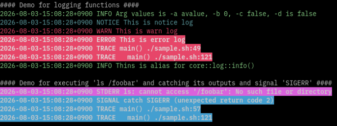

# Neobash

Framework for bash script and libraries.

## Usage

```bash
source lib/neobash.sh
```

## Library Documentation

[Documentation](doc/README.md)

## Sample

* Show help message.

```bash
./sample.sh -h
```

```text
This is sample.sh for neobash.
You can use it to read 'source lib/neobash.sh' command.

Usage:

   ## Options, Flags
   -a --aoption [string]                (required): This is -a string option.
                                                    You can inseart line break.
   -b [int]                             (optional): This is -b int option with default.   DEFAULT: "0"
   -c [bool]                            (optional): This is -c bool option with no default.   DEFAULT: "false"
   -d                                   (flag)    : Thin is -d flag. ARG_D will be true if it's set.

   ## Global Flags
   -h, --help                           (flag)    : show help message
   -v, --version                        (flag)    : show version
   --debug                              (flag)    : print all debug logs but until the the arg is parsed, no debug logs will be shown.

   ## Global Main Environment Variables for logging
   LOG_DEBUG=[bool]                     print all debug logs   DEFAULT: "false"
   LOG_DEBUG_FUNC=[string]              print debug logs for the specified function names   DEFAULT: ""
   LOG_DEBUG_FILE=[string]              print debug logs for the specified file names   DEFAULT: ""
   LOG_FORMAT=["plain"|"json"]          select log format   DEFAULT: "plain"
```

* Run.

```bash
./sample.sh -a avalue
```

```text
#### Demo for arguments parser ####
##### Show all options and flags for main()
label  short option  long option  type    required  store  default  help message
ARG_A  -a            --aoption    string  true      none   ""       "This is -a string option.\nYou can inseart line break."
ARG_B  -b                         int     false     none   "0"      "This is -b int option with default."
ARG_C  -c                         bool    false     none   "false"  "This is -c bool option with no default."
ARG_D  -d                         bool    false     true   "false"  "Thin is -d flag. ARG_D will be true if it's set."
#### Show all labels and values for main()
ARG_A=avalue
ARG_B=0
ARG_C=false
ARG_D=false
OTHER ARGS=

#### Demo for logging functions ####
2026-08-08-15:37:46+0900 INFO Arg values is -a avalue, -b 0, -c false, -d is false
2026-08-08-15:37:46+0900 NOTICE This is notice log
2026-08-08-15:37:46+0900 WARN This is warn log
2026-08-08-15:37:46+0900 ERROR This is error log
2026-08-08-15:37:46+0900 TRACE main() ./sample.sh:49
2026-08-08-15:37:46+0900 TRACE   main() ./sample.sh:121
2026-08-08-15:37:46+0900 INFO Thins is alias for core::log::info()

#### Demo for executing 'ls /foobar' and catching its outputs and signal 'SIGERR' ####
2026-08-08-15:37:46+0900 STDERR ls: cannot access '/foobar': No such file or directory
2026-08-08-15:37:46+0900 SIGNAL catch SIGERR (unexpected return code 2)
2026-08-08-15:37:46+0900 TRACE main() ./sample.sh:57
2026-08-08-15:37:46+0900 TRACE   main() ./sample.sh:121

#### Demo for core::log::stack_trace() ####
2026-08-08-15:37:46+0900 TRACE main() ./sample.sh:61
2026-08-08-15:37:46+0900 TRACE   main() ./sample.sh:121

#### Demo for core::log::echo() and core::log::echo_err() ####
This is stdout message
This is stderr message

#### Demo for nb::get_libs() to show all imported libraries. ####
2026-08-08-15:37:46+0900 INFO imported libs: neobash.sh core/log.sh core/arg.sh

#### Demo for checking whether specified library is imported or not ####
2026-08-08-15:37:46+0900 INFO core/log.sh is imported

#### Demo for importing util/cmd.sh and call util::cmd::exec() ####
2026-08-08-15:37:46+0900 INFO importing util/cmd.sh
2026-08-08-15:37:47+0900 INFO sub_function() stdout is "This is stdout in sub()"
2026-08-08-15:37:47+0900 INFO sub_function() stderr is "This is stderr in sub()"

#### Demo for array serialization ####
ARRAY_ORG=
a1 a2 a3

ARRAY_SERIALIZED=
array
MA==:YTE=
MQ==:YTI=
Mg==:YTM=

ARRAY_DECODED=
a1 a2 a3
```

In terminal, the log output is colorized.



* Run with all debug messages.

```bash
LOG_DEBUG=true ./sample.sh -a avalue
```

```text
2026-08-08-15:33:32+0900 DEBUG importing library /home/user/neobash/lib/core/log.sh
2026-08-08-15:33:32+0900 DEBUG library path: /home/user/neobash/lib   [__nb::init__() /home/user/neobash/lib/neobash.sh:231]
2026-08-08-15:33:32+0900 DEBUG searching library 'core/*' in /home/user/neobash/lib   [nb::import() /home/user/neobash/lib/neobash.sh:44]
2026-08-08-15:33:32+0900 DEBUG importing library core/arg.sh in /home/user/neobash/lib   [nb::import() /home/user/neobash/lib/neobash.sh:59]
2026-08-08-15:33:32+0900 DEBUG library 'core/log.sh' already impported   [nb::import() /home/user/neobash/lib/neobash.sh:51]
2026-08-08-15:33:32+0900 TRACE nb::import() /home/user/neobash/lib/neobash.sh:51
2026-08-08-15:33:32+0900 TRACE   __nb::init__() /home/user/neobash/lib/neobash.sh:232
2026-08-08-15:33:32+0900 TRACE     source() /home/user/neobash/lib/neobash.sh:247
2026-08-08-15:33:32+0900 TRACE       main() ./sample.sh:5
2026-08-08-15:33:32+0900 DEBUG checking bash minimum version ( 4.2.0 <= 5.1.8 )   [nb::check_bash_min_version() /home/user/neobash/lib/neobash.sh:176]
2026-08-08-15:33:32+0900 DEBUG parsing args '-a avalue' at main() ./sample.sh:36   [core::arg::parse() /home/user/neobash/lib/core/arg.sh:368]
2026-08-08-15:33:32+0900 DEBUG ${ARGS[ARG_A]}="avalue"   [core::arg::parse() /home/user/neobash/lib/core/arg.sh:446]
2026-08-08-15:33:32+0900 DEBUG ${ARGS[ARG_B]}="0" (default)   [core::arg::parse() /home/user/neobash/lib/core/arg.sh:476]
2026-08-08-15:33:32+0900 DEBUG ${ARGS[ARG_C]}="false" (default)   [core::arg::parse() /home/user/neobash/lib/core/arg.sh:476]
2026-08-08-15:33:32+0900 DEBUG ${ARGS[ARG_D]}="false" (default)   [core::arg::parse() /home/user/neobash/lib/core/arg.sh:476]
#### Demo for arguments parser ####
##### Show all options and flags for main()
label  short option  long option  type    required  store  default  help message
ARG_A  -a            --aoption    string  true      none   ""       "This is -a string option.\nYou can inseart line break."
ARG_B  -b                         int     false     none   "0"      "This is -b int option with default."

(snip)
```

* Run with debug log for sample.sh only.

```bash
LOG_DEBUG_FILE="sample.sh" ./sample.sh -a avalue
```

